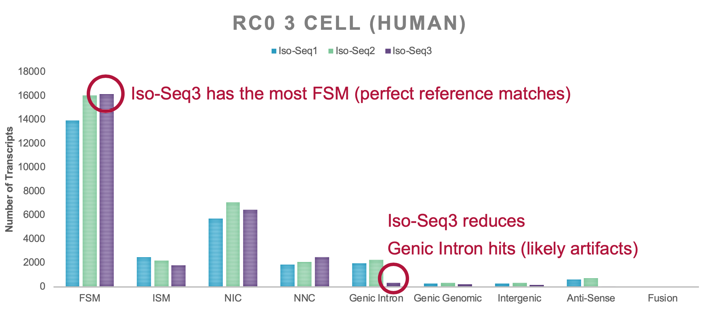
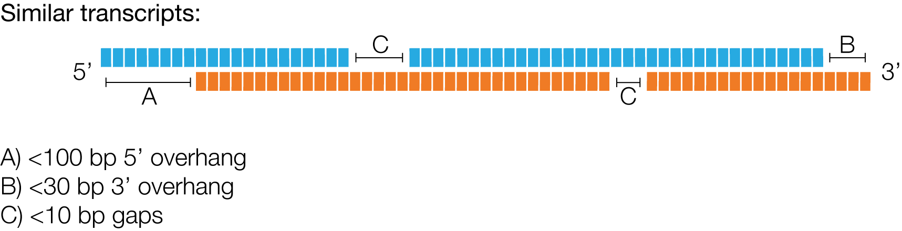
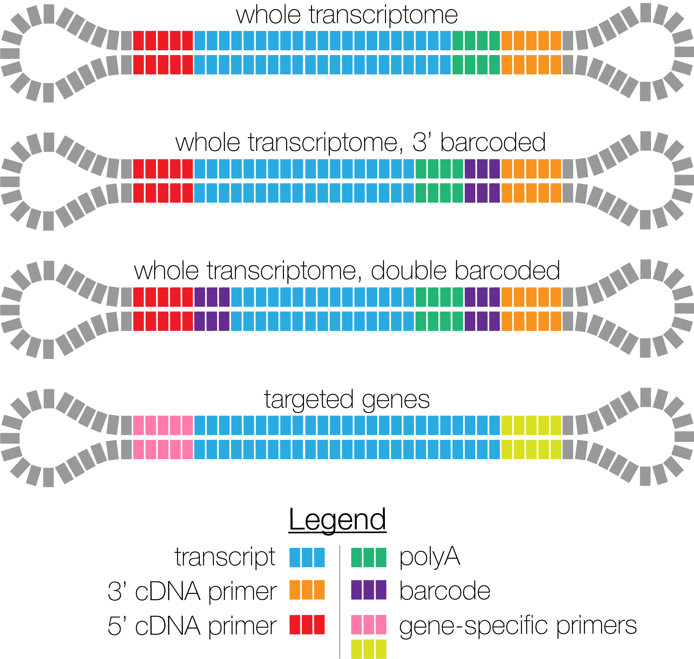

<h1 align="center"></h1>
<h1 align="center">IsoSeq v3</h1>

Scalable De Novo Isoform Discovery

***

*IsoSeq v3* contains the newest tools to identify transcripts in
PacBio single-molecule sequencing data.
Starting in SMRT Link v6.0.0, those tools power the
*IsoSeq GUI-based analysis* application.
A composable workflow of existing tools and algorithms, combined with
a new clustering technique, allows to process the ever-increasing yield of PacBio
machines with similar performance to *IsoSeq* versions 1 and 2.
Starting with version 3.4, support for UMI and cell barcode based deduplication
has been added.

## Availability
Latest version can be installed via bioconda package `isoseq3`.

Please refer to our [official pbbioconda page](https://github.com/PacificBiosciences/pbbioconda)
for information on Installation, Support, License, Copyright, and Disclaimer.

## Workflow Documentation

 * [Iso-Seq Clustering](isoseq-clustering.md)
 * [Iso-Seq Deduplication (UMIs and cell barcodes)](isoseq-deduplication.md)

## Changelog
 * **3.4.0**
   * SMRT Link release 10.0.0
   * Add support for UMI and cell barcode handling, by adding `tag` and `dedup`
   * Add `refine --min-rq` to support RQ filtering for unfiltered `<movie>.reads.bam` input
 * 3.3.0
   * SMRT Link release 9.0.0
 * 3.2.2
   * Fix `polish` not generating fasta/q output. This bug was introduced in v3.2.0
 * 3.2.1
   * Fix a gff index 1-off bug in `collapse`
   * We have removed implicit dependencies from the bioconda recipe. Please install `pbccs`, `lima`, and `pbcoretools` as needed.
 * 3.2.0
   * **`polish` dropped support for RS II datasets!**
   * Add `collapse` step for aligned transcript BAM input
   * Enable CCS-only workflow `cluster --use-qvs`
   * Add `refine --min-polya-length`
   * Add `cluster --singletons` to output unclustered FLNCs; potential sample prep artifacts!
   * Fix minimap2 bugs. Outputs might change slightly.
 * 3.1.2
   * Reduce `polish` memory footprint
 * 3.1.1
   * Edge case fix where `polish` would not finish and stale
   * Improve `polish` run time for large scale datasets (> 1M CCS)
   * Improve `polish` result quality
 * 3.1.0
   * We outsourced the poly(A) tail removal and concatemer detection into a new tool
called `refine`. Your custom `primers.fasta` is used in this step to detect
concatemers.

## FAQ
### Where is the workflow starting from unpolished CCS reads?
To simplify, unify, and future proof Iso-Seq, we decided to remove documentation
starting from unpolished CCS reads. With the ever-increasing polymerase read
lengths and improvements of CCS, going forward, it is recommended to generate
polished CCS reads first and thus make final transcript polishing optional.

### Why IsoSeq v3 and not the established versions 1 or 2?
The ever-increasing throughput of the Sequel system gave rise to the need for a
scalable software solution that can handle millions of CCS reads, while
maintaining sensitivity and accuracy. Internal benchmarks have shown that
*IsoSeq v3* is orders of magnitude faster than currently employed solutions and
[SQANTI](https://bitbucket.org/ConesaLab/sqanti) attributes *IsoSeq v3* a higher
number of perfectly annotated isoforms:

Additional benefit, single linux binary that requires no dependencies.

### Why is the number of transcripts much lower with IsoSeq v3?
Even though we also observe fewer polished transcripts with *IsoSeq v3*, the
overall quality is much higher. Most of the low-quality transcripts are lost in the
demultiplexing step. *Isoseq v1/2 classify* is too relaxed and is not filtering
junk molecules to a satisfactory level. In fact, *lima* calls are spot on and
effectively removes most molecules that are wrongly tagged, as in two 5' or two
3' primers. Only a proper 5' and 3' primer pair allows to identify a full-length
transcript and its orientation.

### I can't find the *classify* step
Starting with version 3.1, *classify* functionality has been split into two tools.
Removal of (barcoded) primers is performed with PacBio's standard demultiplexing
tool *lima*. *Lima* does not remove poly(A) tails, nor detects concatemers.
For this, `isoseq refine` generates FLNC reads.

For version 3.0, poly(A) tail removal and concatemer detection is performed in
`isoseq cluster`

### My sample has poly(A) tails, how can I remove them?
Use `--require-polya` for `isoseq refine`.
This filters for FL reads that have a poly(A) tail
with at least 20 base pairs and removes identified tail.

### How long will it take until my data has been processed?
There is no ETA feature. Depending on the sample type, whole transcriptome
or targeted amplification, run time varies. The same number of reads from a
whole transcriptome sample can finish clustering in minutes, whereas a single
gene amplification of 10kb transcripts can take a couple of hours.

### Which clustering algorithm is used?
In contrast to its predecessors, *IsoSeq v3* does not rely on NP-hard clique
finding, but uses a hierarchical alignment strategy with `O(N*log(N))`.
Recent advances in rapid alignment of long reads make this this approach
feasible.

### How many CCS reads are used for the unpolished cluster sequence representation?
*Cluster* uses up to 10 CCS reads to generate the unpolished cluster consensus.

### How many subreads are used for polishing?
*Polish* uses up to 60 subreads to polish the cluster consensus.

### When are two reads clustered?
*IsoSeq v3* deems two reads to stem from the same transcript, if they meet
following criteria:

There is no upper limit on the number of gaps.

### BAM tags explained
Following BAM tags are being used:

 - `ib` Barcode summary: triplets delimited by semicolons, each triplet contains two barcode indices and the ZMW counts, delimited by comma. Example: `0,1,20;0,3,5`
 - `ic` Sum of number of passes from all ZMWs used to create consensus
 - `im` ZMW names associated with this isoform
 - `is` Number of ZMWs associated with this isoform
 - `it` List of barcodes/UMIs clipped during `tag`
 - `iz` Maximum number of subreads used for polishing
 - `rq` Predicted accuracy for polished isoform
 - `XA` Order of `tag` names
 - `XC` barcode sequence `tag`
 - `XG` PacBio's `GGG` UMI suffix `tag`
 - `XM` UMI sequence `tag`
 - `XO` overhang sequence `tag`

 Quality values are capped at `93`.

### What SMRTbell designs are possible?

PacBio supports three different SMRTbell designs for IsoSeq libraries.
In all designs, transcripts are labelled with asymmetric primers,
whereas a poly(A) tail is optional. Barcodes may be optionally added.

### The binary does not work on my linux system!
Binaries require **SSE4.1 CPU support**; CPUs after 2008 (Penryn) include it.

## DISCLAIMER

THIS WEBSITE AND CONTENT AND ALL SITE-RELATED SERVICES, INCLUDING ANY DATA, ARE PROVIDED "AS IS," WITH ALL FAULTS, WITH NO REPRESENTATIONS OR WARRANTIES OF ANY KIND, EITHER EXPRESS OR IMPLIED, INCLUDING, BUT NOT LIMITED TO, ANY WARRANTIES OF MERCHANTABILITY, SATISFACTORY QUALITY, NON-INFRINGEMENT OR FITNESS FOR A PARTICULAR PURPOSE. YOU ASSUME TOTAL RESPONSIBILITY AND RISK FOR YOUR USE OF THIS SITE, ALL SITE-RELATED SERVICES, AND ANY THIRD PARTY WEBSITES OR APPLICATIONS. NO ORAL OR WRITTEN INFORMATION OR ADVICE SHALL CREATE A WARRANTY OF ANY KIND. ANY REFERENCES TO SPECIFIC PRODUCTS OR SERVICES ON THE WEBSITES DO NOT CONSTITUTE OR IMPLY A RECOMMENDATION OR ENDORSEMENT BY PACIFIC BIOSCIENCES.
