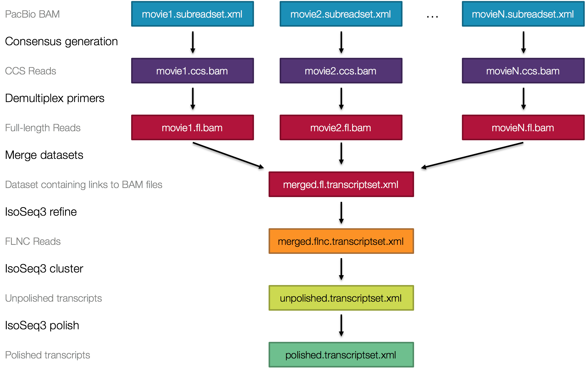
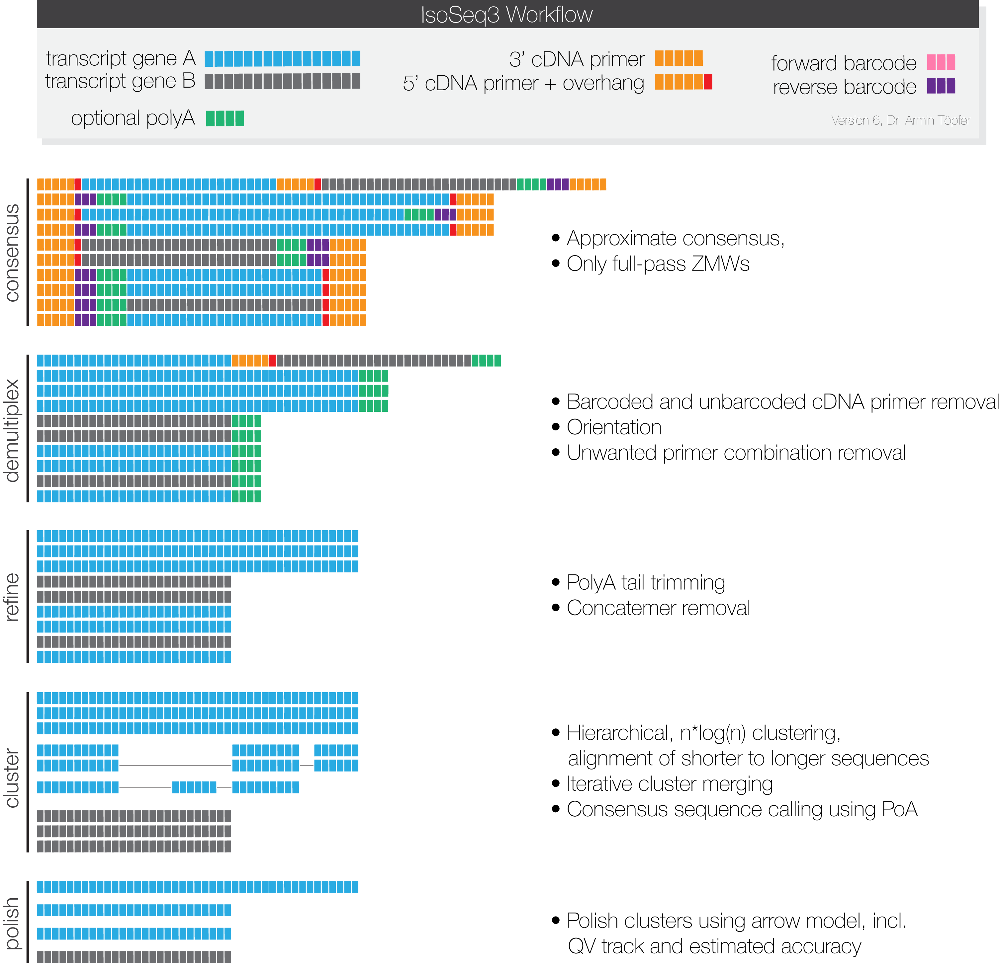

<h1 align="center"></h1>
<h1 align="center">IsoSeq 3.1</h1>

Scalable De Novo Isoform Discovery

***

*IsoSeq3* contains the newest tools to identify transcripts in
PacBio single-molecule sequencing data.
Starting in SMRT Link v6.0.0, those tools power the
*IsoSeq3 GUI-based analysis* application.
A composable workflow of existing tools and algorithms, combined with
a new clustering technique, allows to process the ever-increasing yield of PacBio
machines with similar performance to *IsoSeq1* and *IsoSeq2*.

## Availability
Latest version can be installed via bioconda package `isoseq3`.

Please refer to our [official pbbioconda page](https://github.com/PacificBiosciences/pbbioconda)
for information on Installation, Support, License, Copyright, and Disclaimer.

## Overview
 - Workflow Overview: [high](README_v3.1.md#high-level-workflow) / [mid](README_v3.1.md#mid-level-workflow) / [low](README_v3.1.md#low-level-workflow) level
 - [Real-World Example](README_v3.1.md#real-world-example)
 - [FAQ](README_v3.1.md#faq)
 - [SMRTbell Designs](README_v3.1.md#what-smrtbell-designs-are-possible)

## High-level workflow

The high-level workflow depicts files and processes:

## Mid-level workflow

The mid-level workflow schematically explains what happens at each stage:

## Low-level workflow

The low-level workflow explained via CLI calls. All necessary dependencies are
installed via bioconda.

### Step 0 - Input
For each SMRT cell, the `movieX.subreads.bam`, `movieX.subreads.bam.pbi`,
and `movieX.subreadset.xml` are needed for processing.

### Step 1 - Circular Consensus Sequence calling
Each sequencing run is processed by [*ccs*](https://github.com/PacificBiosciences/unanimity)
to generate one representative circular consensus sequence (CCS) for each ZMW. Only ZMWs with
at least one full pass (at least one subread with SMRT adapter on both ends) are
used for the subsequent analysis. Polishing is not necessary
in this step and is by default deactivated through.

    $ ccs movieX.subreads.bam movieX.ccs.bam --noPolish --minPasses 1

For long movies and short inserts, it is advised to limit the number of subreads
used per ZMW; this can decrease run-time (only available in ccs version ≥ 3.1.0):

    $ ccs movieX.subreads.bam movieX.ccs.bam --noPolish --minPasses 1 --maxPoaCoverage 10

For **CCS version ≥ 4.0.0** use this call:

    $ ccs movieX.subreads.bam movieX.ccs.bam --skip-polish --min-passes 1 --draft-mode winpoa --disable-heuristics

### Step 2 - Primer removal and demultiplexing
Removal of primers and identification of barcodes is performed using [*lima*](https://github.com/pacificbiosciences/barcoding),
which offers a specialized `--isoseq` mode.
Even in the case that your sample is not barcoded, primer removal is performed
by *lima*.
If there are more than two sequences in your `primer.fasta` file or better said
more than one pair of 5' and 3' primers, please use *lima* with `--peek-guess`
to remove spurious false positive signal.
More information about how to name input primer(+barcode)
sequences in this [FAQ](https://github.com/pacificbiosciences/barcoding#how-can-i-demultiplex-isoseq-data).

    $ lima movieX.ccs.bam barcoded_primers.fasta movieX.fl.bam --isoseq --peek-guess

**Example 1:**
Following is the `primer.fasta` for the Clontech SMARTer and NEB cDNA library
prep, which are the officially recommended protocols:

    >NEB_5p
    GCAATGAAGTCGCAGGGTTGGG
    >Clontech_5p
    AAGCAGTGGTATCAACGCAGAGTACATGGGG
    >NEB_Clontech_3p
    GTACTCTGCGTTGATACCACTGCTT

**Example 2:**
Following are examples for barcoded primers using a 16bp barcode followed by
Clontech primer:

    >primer_5p
    AAGCAGTGGTATCAACGCAGAGTACATGGGG
    >brain_3p
    CGCACTCTGATATGTGGTACTCTGCGTTGATACCACTGCTT
    >liver_3p
    CTCACAGTCTGTGTGTGTACTCTGCGTTGATACCACTGCTT

*Lima* will remove unwanted combinations and orient sequences to 5' → 3' orientation.

Output files will be called according to their primer pair. Example for
single sample libraries:

    movieX.fl.NEB_5p--NEB_Clontech_3p.bam

If your library contains multiple samples, execute the following workflow
for each primer pair:

    movieX.fl.primer_5p--brain_3p.bam
    movieX.fl.primer_5p--liver_3p.bam

### Step 3 - Refine
Your data now contains full-length reads, but still needs to be refined by:
 - [Trimming](https://github.com/PacificBiosciences/trim_isoseq_polyA) of poly(A) tails
 - Rapid concatmer [identification](https://github.com/jeffdaily/parasail) and removal

**Input**
The input file for *refine* is one demultiplexed CCS file with full-length reads
and the primer fasta file:
 - `<movie.primer--pair>.fl.bam` or `<movie.primer--pair>.fl.consensusreadset.xml`
 - `primers.fasta`

**Output**
The following output files of *refine* contain full-length non-concatemer reads:
 - `<movie>.flnc.bam`
 - `<movie>.flnc.transcriptset.xml`

Actual command to refine:

    $ isoseq3 refine movieX.NEB_5p--NEB_Clontech_3p.fl.bam primers.fasta movieX.flnc.bam

If your sample has poly(A) tails, use `--require-polya`.
This filters for FL reads that have a poly(A) tail
with at least 20 base pairs and removes identified tail:

    $ isoseq3 refine movieX.NEB_5p--NEB_Clontech_3p.fl.bam movieX.flnc.bam --require-polya

### Step 3b - Merge SMRT Cells
If you used more than one SMRT cells, use `dataset` for merging.
Merge all of your `<movie>.flnc.bam` files:

    $ dataset create --type TranscriptSet merged.flnc.xml movie1.flnc.bam movie2.flnc.bam movieN.flnc.bam

Similarly, merge all of your **source** `<movie>.subreadset.xml` files:

    $ dataset create --type SubreadSet merged.subreadset.xml movie1.subreadset.xml movie2.subreadset.xml movieN.subreadset.xml

### Step 4 - Clustering
Compared to previous IsoSeq approaches, *IsoSeq3* performs a single clustering
technique.
Due to the nature of the algorithm, it can't be efficiently parallelized.
It is advised to give this step as many coresas possible.
The individual steps of *cluster* are as following:

 - Clustering using hierarchical n*log(n) [alignment](https://github.com/lh3/minimap2) and iterative cluster merging
 - Unpolished [POA](https://github.com/rvaser/spoa) sequence generation

**Input**
The input file for *cluster* is one FLNC file:
 - `<movie>.flnc.bam` or `merged.flnc.xml`

**Output**
The following output files of *cluster* contain unpolished isoforms:
 - `<prefix>.bam`
 - `<prefix>.fasta`
 - `<prefix>.bam.pbi`
 - `<prefix>.transcriptset.xml`

Example invocation:

    $ isoseq3 cluster merged.flnc.xml unpolished.bam --verbose

### Step 5 - Serial Polishing
The algorithm behind *polish* is the *arrow* model that also used for CCS
generation and polishing of de-novo assemblies.

**Input**
The input files for *polish* are:
 - `<unpolished>.bam` or `<unpolished>.transcriptset.xml`
 - `<movieX>.subreadset.xml` or `merged.subreadset.xml`

**Output**
The following output files of *polish* contain polished isoforms:
 - `<prefix>.bam`
 - `<prefix>.transcriptset.xml`
 - `<prefix>.hq.fasta.gz` with predicted accuracy ≥ 0.99
 - `<prefix>.lq.fasta.gz` with predicted accuracy < 0.99
 - `<prefix>.hq.fastq.gz` with predicted accuracy ≥ 0.99
 - `<prefix>.lq.fastq.gz` with predicted accuracy < 0.99

Example invocation:

    $ isoseq3 polish unpolished.bam merged.subreadset.xml polished.bam

### Alternative Step 4/5 - Parallel Polishing
Polishing can be massively parallelized on multiple servers by splitting
the `unpolished.bam` file.
Split BAM files can be generated by *cluster*.

    $ isoseq3 cluster merged.flnc.xml unpolished.bam --verbose --split-bam 24

This will create up to 24 output BAM files:

    unpolished.0.bam
    unpolished.1.bam
    ...

Each of those `unpolished.<X>.bam` files can be polished in parallel:

    $ isoseq3 polish unpolished.0.bam sample.subreadset.xml polished.0.bam
    $ isoseq3 polish unpolished.1.bam sample.subreadset.xml polished.1.bam
    $ ...

## Real-world example
This is an example of an end-to-end cmd-line-only workflow to get from
subreads to polished isoforms:

    $ wget https://downloads.pacbcloud.com/public/dataset/RC0_1cell_2017/m54086_170204_081430.subreads.bam
    $ wget https://downloads.pacbcloud.com/public/dataset/RC0_1cell_2017/m54086_170204_081430.subreads.bam.pbi
    $ wget https://downloads.pacbcloud.com/public/dataset/RC0_1cell_2017/m54086_170204_081430.subreadset.xml

    $ ccs --version
    ccs 3.1.0 (commit v3.1.0)

    $ ccs m54086_170204_081430.subreads.bam m54086_170204_081430.ccs.bam \
          --noPolish --minPasses 1 --maxPoaCoverage 10

    $ cat primers.fasta
    >primer_5p
    AAGCAGTGGTATCAACGCAGAGTACATGGGG
    >primer_3p
    AAGCAGTGGTATCAACGCAGAGTAC

    $ lima --version
    lima 1.9.0 (commit v1.9.0)

    $ lima m54086_170204_081430.ccs.bam primers.fasta m54086_170204_081430.fl.bam \
           --isoseq --peek-guess

    $ ls m54086_170204_081430.fl*
    m54086_170204_081430.fl.json         m54086_170204_081430.fl.lima.summary
    m54086_170204_081430.fl.lima.clips   m54086_170204_081430.fl.primer_5p--primer_3p.bam
    m54086_170204_081430.fl.lima.counts  m54086_170204_081430.fl.primer_5p--primer_3p.subreadset.xml
    m54086_170204_081430.fl.lima.report

    $ isoseq3 refine m54086_170204_081430.fl.primer_5p--primer_3p.bam primers.fasta m54086_170204_081430.flnc.bam

    $ ls m54086_170204_081430.flnc.*
    m54086_170204_081430.flnc.bam                   m54086_170204_081430.flnc.filter_summary.json
    m54086_170204_081430.flnc.bam.pbi               m54086_170204_081430.flnc.report.csv
    m54086_170204_081430.flnc.consensusreadset.xml

    $ isoseq3 cluster m54086_170204_081430.flnc.bam unpolished.bam --verbose
    Read BAM                 : (197791) 4s 20ms
    Convert to reads         : 1s 431ms
    Sort Reads               : 56ms 947us
    Aligning Linear          : 2m 5s
    Read to clusters         : 9s 432ms
    Aligning Linear          : 54s 288ms
    Merge by mapping         : 36s 138ms
    Consensus                : 30s 126ms
    Merge by mapping         : 5s 418ms
    Consensus                : 3s 597ms
    Write output             : 1s 134ms
    Complete run time        : 4m 32s

    $ ls unpolished*
    unpolished.bam  unpolished.bam.pbi  unpolished.cluster  unpolished.fasta  unpolished.transcriptset.xml

    $ isoseq3 polish unpolished.bam m54086_170204_081430.subreadset.xml polished.bam --verbose
    14561

    $ ls polished*
    polished.bam                 polished.hq.fastq.gz
    polished.bam.pbi             polished.lq.fasta.gz
    polished.cluster_report.csv  polished.lq.fastq.gz
    polished.hq.fasta.gz         polished.transcriptset.xml

Or run *isoseq3 cluster* it in split mode and `isoseq3 polish` in parallel:

    $ isoseq3 cluster m54086_170204_081430.flnc.bam unpolished.bam --split-bam 24
    $ isoseq3 polish unpolished.0.bam m54086_170204_081430.subreadset.xml polished.0.bam
    $ isoseq3 polish unpolished.1.bam m54086_170204_081430.subreadset.xml polished.1.bam
    $ ...

## DISCLAIMER

THIS WEBSITE AND CONTENT AND ALL SITE-RELATED SERVICES, INCLUDING ANY DATA, ARE PROVIDED "AS IS," WITH ALL FAULTS, WITH NO REPRESENTATIONS OR WARRANTIES OF ANY KIND, EITHER EXPRESS OR IMPLIED, INCLUDING, BUT NOT LIMITED TO, ANY WARRANTIES OF MERCHANTABILITY, SATISFACTORY QUALITY, NON-INFRINGEMENT OR FITNESS FOR A PARTICULAR PURPOSE. YOU ASSUME TOTAL RESPONSIBILITY AND RISK FOR YOUR USE OF THIS SITE, ALL SITE-RELATED SERVICES, AND ANY THIRD PARTY WEBSITES OR APPLICATIONS. NO ORAL OR WRITTEN INFORMATION OR ADVICE SHALL CREATE A WARRANTY OF ANY KIND. ANY REFERENCES TO SPECIFIC PRODUCTS OR SERVICES ON THE WEBSITES DO NOT CONSTITUTE OR IMPLY A RECOMMENDATION OR ENDORSEMENT BY PACIFIC BIOSCIENCES.
