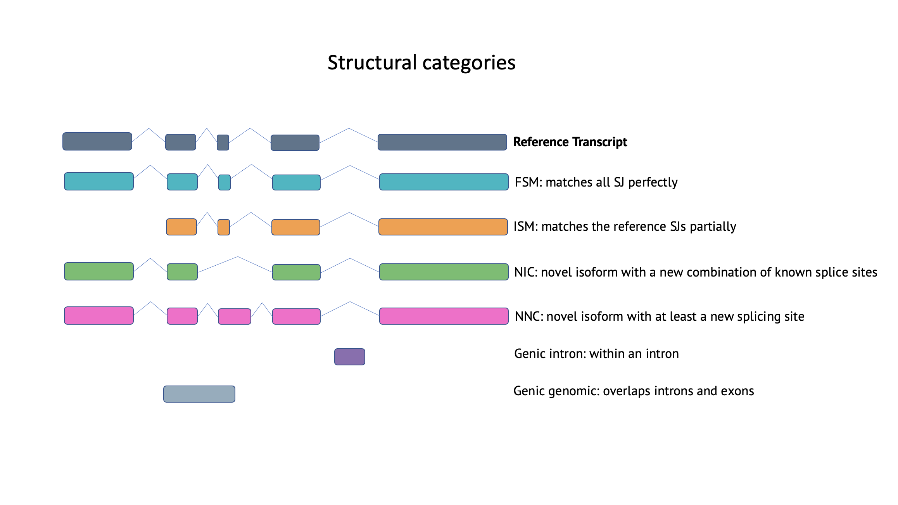

## Isoform Categories

Pigeon follows the [SQANTI3](https://github.com/ConesaLab/SQANTI3) classification categories.

| Category | Description |
| ----- | ----------- |
| FSM (Full Splice Match) | The reference and query isoform have the same number of exons and each internal junction matches the positions of the reference. The exact 5' start and 3' end can differ within the first/last exons. |
| ISM (Incomplete Splice Match) | The query isoform has fewer external exons than the reference, but each internal junction matches the positions of the reference. The exact 5' start and 3' end can differ within the first/last exons. |
| NIC (Novel In Catalog) | The query isoform does not have a FSM or ISM match, but is using a combination of known donor/acceptor sites. |
| NNC (Novel Not in Catalog) | The query isoform does not have a FSM or ISM match, and has at least one donor or acceptor site that is not annotated. |
| Antisense | The query isoform does not have overlap a same-strand reference gene but is anti-sense to an annotated gene. |
| Genic Intron | The query isoform is completely contained within a reference intron. |
| Genic Genomic | The query isoform overlaps with introns and exons. |
| Intergenic | The query isoform is in the intergenic region. |

## Category Overview

## Subcategories

Additionally there are categories that are divided into subcategories.

