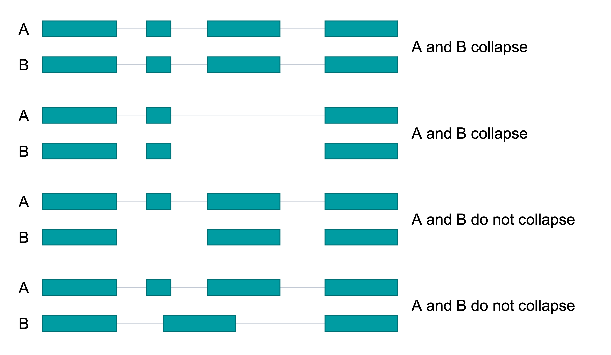

## IsoSeq collapse

After reads are mapped to a reference genome, transcripts can be collapsed into unique isoforms using `isoseq3 collapse`. Mapped IsoSeq reads are collapsed to produce a set of unique isoforms for each locus of the genome in GFF format, along with a secondary files containing information about the number of processed reads supporting each unique isoform.

### Examples



### Execution

Collapse mapped reads into unique isoforms using _isoseq collapse_.

```
isoseq3 collapse <mapped.bam> <collapse.gff>
```
