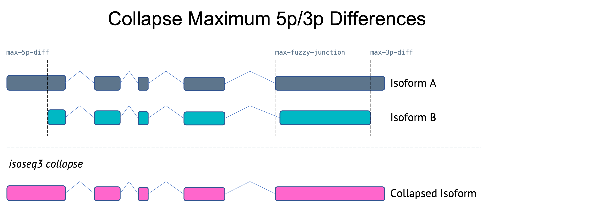

# IsoSeq Collapse

After transcript sequences are mapped to a reference genome, `isoseq3 collapse` can be used to collapse redundant transcripts (based on exonic structures) into unique isoforms. Output consists of unique isoforms in GFF format and secondary files containing information about the number of reads supporting each unique isoform.

### Collapse Examples


### Execution

Map reads using _pbmm2_ before collapsing

```
pbmm2 align --preset ISOSEQ --sort <input.bam> <ref.fa> <mapped.bam>
```

Collapse mapped reads into unique isoforms using _isoseq collapse_.

```
isoseq3 collapse <mapped.bam> <collapse.gff>
```

Note: `isoseq3 collapse` by default will collapse isoforms containing 5p degradation as of version `3.8.0`. To turn this off `--do-not-collapse-extra-5exons` should be used. This option is recommended for bulk IsoSeq.

### Ouptut

- `collapse.gff` contains the collapsed isoforms in gff format.
- `*.abundance.txt` contains information about the number of FLNC reads supporting each isoform and cell barcodes if applicable. Each unique isoform has the ID format PB.X.Y, while `count_fl` denotes the number of unique molecules (after UMI deduplication) supporting the isoform, and `fl_assoc` denotes the number of reads (before UMI deduplication) supporting it. `cell_barcodes` shows the list of single cell barcodes from which the reads came from, if applicable.
    ```
    pbid	count_fl	fl_assoc	cell_barcodes
    PB.1.1	2	2	ATCCATTCACCTCTGT,ATCGGCGCAGAGATGC
    PB.2.1	1	1	CGGACACCATTGCCGG
    PB.3.1	1	1	ACTTCGCGTCTAACTG
    ```
- `*.group.txt` shows the grouping of redundant isoforms (based on mapped exonic structures), where the read names `molecule/<number>` denote a unique molecule after UMI deduplication.
    ```
    PB.1.1	molecule/7343975,molecule/7738347
    PB.2.1	molecule/14601188
    PB.3.1	molecule/3998518
    ```
- `*.read_stat.txt` shows the assignment of each read (before UMI deduplication) to the final, unique isoforms PB.X.Y. Read names with the format `<movie>/<zmw>/ccs` indicate a CCS read, whereas `<movie>/<zmw>/ccs/<start>_<end>` further denotes a segment of a CCS read (S-read), likely as a result of segmentation (using, for example, [Skera](http://skera.how/)) of concatenated single cell libraries.
    ```
    id	pbid
    m64012_220421_000242/120719489/ccs/10460_11196	PB.1.1
    m64012_220421_000242/17565024/ccs/13918_14203	PB.1.1
    m64012_220421_000242/161089449/ccs/1955_2888	PB.2.1
    m64012_220421_000242/158664505/ccs/2488_2901	PB.3.1
    ```

# Collapse FAQ

As of *isoseq3 v3.8.0* `isoseq3 collapse` has algorithmic updates. 
These updates include performance improvements and updates to isoform collapse logic. 

## What is new in *v3.8.0* and later?

### Collapsing extra 5p exons

For applications like single-cell IsoSeq where there is a higher percentage of 5p truncated isoforms, 
it is useful to collapse isoforms that have a matching exon structure with the exception of extra 5p exons. 
Previous versions of `collapse` did not merge isoforms with extra 5p exons. 
As of *v3.8.0*, `collapse` will merge these isoforms by default.
To not allow merging isoforms with extra 5p exons, use `--do-not-collapse-extra-5exons`. 
This option is used in the bulk IsoSeq workflow. 


### Flexible first/last exon differences

Previous versions of `collapse` used stringent maximum differences (5bp) for both internal junctions and external junctions.
As of *v3.8.0*, the maximum 5p and 3p differences have been increased and paramaters added to allow adjustments. 
Note: the maximum 5p difference only applies when `--do-not-collapse-extra-5exons` is set. 

New *v3.8.0* `collapse` maximum junction difference parameters:

```
  --max-fuzzy-junction            INT    Ignore mismatches or indels shorter than or equal to N. [5]
  --max-5p-diff                   INT    Maximum allowed 5' difference if on same exon. [1000]
  --max-3p-diff                   INT    Maximum allowed 3' difference if on same exon. [100]
```



## What if I want to use the legacy `collapse` logic?

The legacy `collapse` logic can be recreated using the following parameters:

```
isoseq3 collapse --do-not-collapse-extra-5exons --max-5p-diff 5 --max-3p-diff 5 <mapped.bam> <collapsed.gff>
```