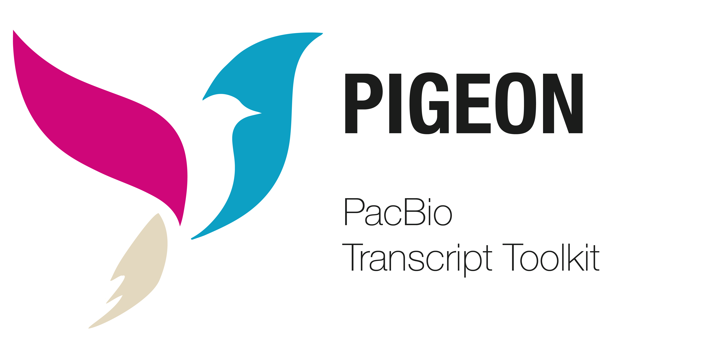

  

## Pigeon

_Pigeon_ is a PacBio Transcript Toolkit that contains tools to classify and filter full-length transcript isoforms into [categories](/classification/categories) against a reference annotation. _Pigeon_ is based off of [SQANTI3](https://github.com/ConesaLab/SQANTI3) and the output is compatible with downstream analysis with Seurat.

## Tools

| Tool | Description |
| ----------- | ---- |
| prepare     | Prepare input files for pigeon tools |
| classify    | Transcript classification |
| filter      | Transcript classification filtering |
| report      | Transcript reporting |
| make-seurat | Generate Seurat-compatible matrices |

## Input

- Collapsed isoforms in GFF format from [IsoSeq collapse](/classification/isoseq-collapse).
- Several reference input files required across all steps of the _pigeon_ workflow are described [here](/classification/pigeon-input).

## Execution

The CLI workflow is described [here](/classification/workflow).

## Availability
The latest version of `pigeon` is distributed through [BioConda](https://github.com/PacificBiosciences/pbbioconda).

## Versions
Version **1.3.0**: [Full changelog here](/classification/pigeon-changelog)
