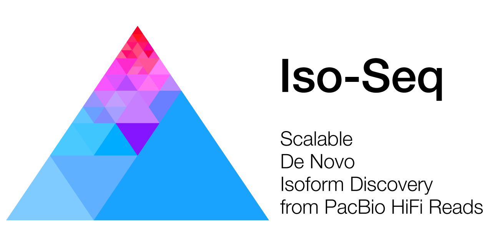

  

***

*Iso-Seq* contains the newest tools to identify transcripts in PacBio
single-molecule sequencing data. Starting in SMRT Link v6.0.0, those tools power
the *Iso-Seq GUI-based analysis* application. A composable workflow of existing
tools and algorithms, combined with a new clustering technique, allows to
process the ever-increasing yield of PacBio. Starting with version 3.4, support
for UMI and cell barcode based deduplication has been added.

## Availability
Latest version can be installed via bioconda package `isoseq3`.

Please refer to our [official pbbioconda page](https://github.com/PacificBiosciences/pbbioconda)
for information on Installation, Support, License, Copyright, and Disclaimer.

## Latest Version
Version **3.4.0**: [Full changelog here](/changelog)

## What's new!
New documentation is up, a 1:1 port from the original GitHub docs with minor
enhancements.

## Get started
If you are new to demultiplexing barcoded samples, check out the [Get Started guide](/get-started).
