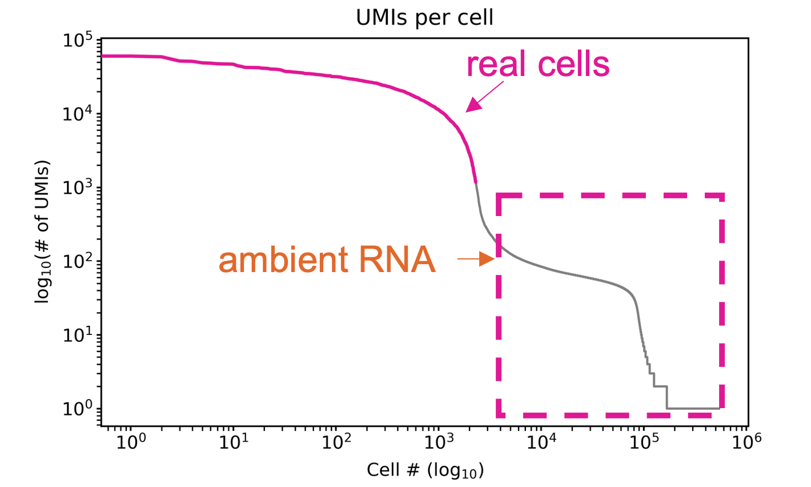
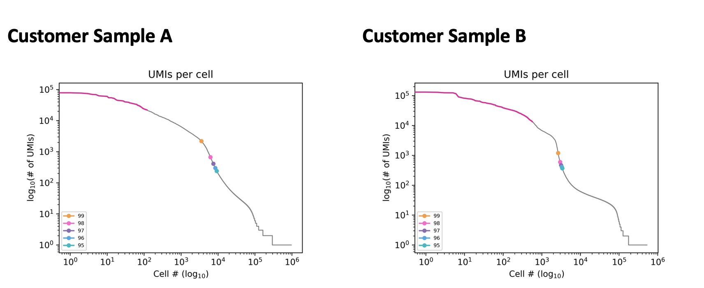
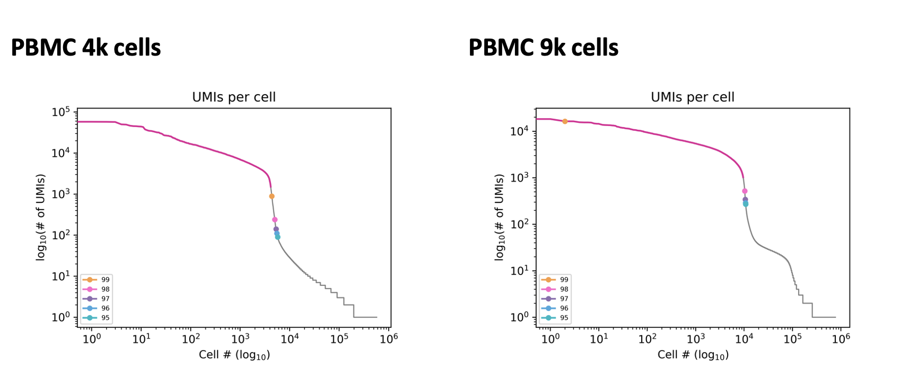
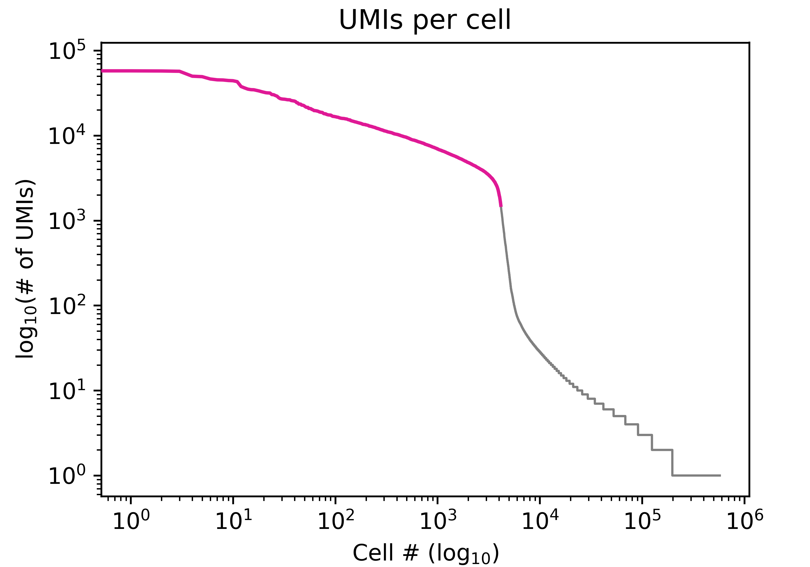
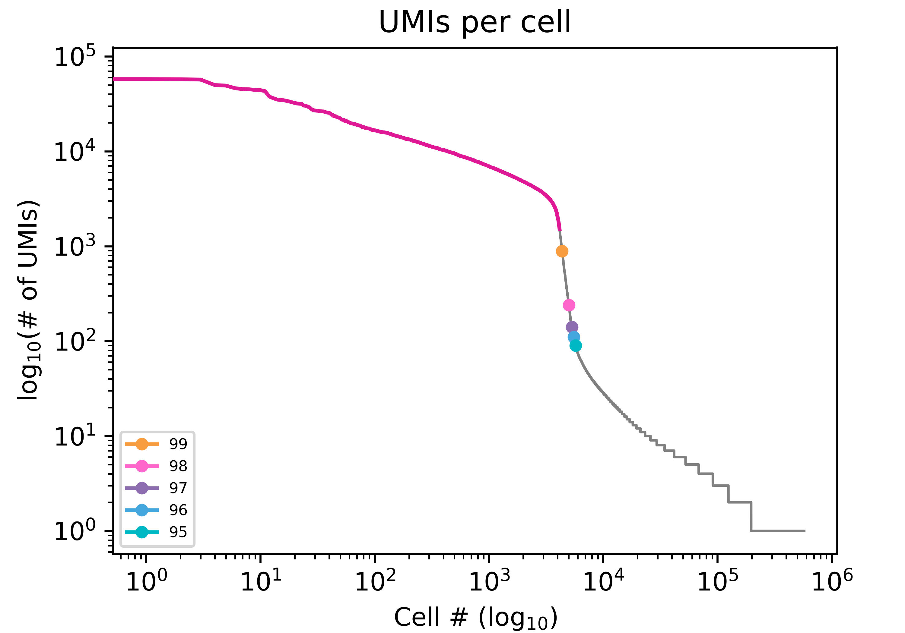

# Cell Calling Documentation

Cell calling is used to separate cell barcodes that are present in real cells from background RNA.

## Barcode Rank Plot
A barcode rank plot is used to diagnose libraries and cell calling. 
The barcode rank plot visualizes the number of UMIs per cell barcode in decreasing order. 
Typically there is a steep decline in the number UMIS per cell barcode that indicates that the remaining barcodes are background. This decline is called the "knee" of the barcode rank plot. 



## Cell Calling Methods

There are two methods for determining real cells in *isoseq3*.

### Knee Finding Method (default)

The knee finding method is the default method for determining real cells. It works by identifying the knee of the barcode rank plot based on [*UMI-tools*](https://github.com/CGATOxford/UMI-tools). 

### Percentile Method

The percentile method approximates real cells based on a percentile cutoff of UMI counts per cell. This method first identifies the X percentile (default 99) of UMI counts per cell, then applies a multiplier of X 10 to generate a cutoff threshold of UMI counts for real cells. 

### Which tools use cell calling?

Both [*isoseq3 correct*](https://isoseq.how/umi/isoseq-bcstats.html) and [*isoseq3 bcstats*](https://isoseq.how/umi/isoseq-correct.html) use cell calling. 
In addition to cell barcode correction, *isoseq correct* labels the bam records from real cells with the `rc` tag. 
After correction, *isoseq3 bcstats* can be used to generate a tsv file that can be used to plot the barcode rank plot. 

The knee finding cell calling method is the default for both *correct* and *bcstats*. To change the cell calling method, the `--method` option should be added. The cutoff percentile can be changed from the default value of 99 to another value using the `--percentile` option. 

To use the percentile method at the default cutoff (99):

```
isoseq3 correct --method percentile ...
isoseq3 bcstats --method percentile ...
```

To lower the percentile cutoff to 97:

```
isoseq3 correct --method percentile --percentile 97 ...
isoseq3 bcstats --method percentile --percentile 97 ...
```


## Troubleshooting Cell Calling

For some sample types the default knee method can underestimate cells. 
In these cases, the percentile method can be used instead. 
The following customer samples were underestimated using the knee method. This is shown by the pink line.
Sample A has a barcode rank plot with a rounded curve instead of a steep knee. 
Sample B has a small drop before the correct knee. 
In both samples, the correct number of cells could be called using the percentile method as seen by the percentile markers.



The optimal percentile cutoff can vary between samples. 
The 99th percentile cutoff is appropriate for the following PBMC sample with 4k cells but not the PBMC sample with 9k cells. 



Additional information about interpreting barcode rank plots can be found in this [technical note](https://assets.ctfassets.net/an68im79xiti/163qWiQBTVi2YLbskJphQX/e90bb82151b1cdab6d7e9b6c845e6130/CG000329_TechnicalNote_InterpretingCellRangerWebSummaryFiles_RevA.pdf). 

### Determinining the correct percentile cutoff

There is a python script available that can be used to determine the correct percentile cutoff to use. 
The barcode rank plot can be generated with various percentile cutoffs from the [*isoseq3 bcstats*](https://isoseq.how/umi/isoseq-bcstats.html) tsv output. 
The pink line shows the real cells labeled from *bcstats* in the tsv file. 

If not already run, *bcstasts* can be run as follows:

```
# Run bcstats on the corrected bam
$ isoseq3 bcstats --json bcstats_report.json -o bcstats_report.tsv <corrected.bam>
```

Download plotting script and install dependencies:
```
# Download plotting script
$ wget https://downloads.pacbcloud.com/public/dataset/MAS-Seq/PLOT-scripts/plot_knees.py

# Install dependencies for plot_knees.py
$ conda install numpy
$ conda install matplotlib

# See help for plotting
$ python3 plot_knees.py --help
usage: plot_knees.py [-h] --tsv TSV --output OUTPUT [--max_cells MAX_CELLS] [--estimate_percentile ESTIMATE_PERCENTILE]

options:
  -h, --help            show this help message and exit
  --tsv TSV, -t TSV     Output tsv file from bcstats (can be gzipped)
  --output OUTPUT, -o OUTPUT
                        Output png prefix (`.knee.png` gets added)
  --max_cells MAX_CELLS, -m MAX_CELLS
                        Force an x axis maximum instead of the mpl default
  --estimate_percentile ESTIMATE_PERCENTILE, -e ESTIMATE_PERCENTILE
                        Calculates 99th through Nth (inclusive) percentiles for real cell cutoff [None]
```

Generate barcode rank plot without percentile markers:
```
# Plot barcode rank plot without percentile markers
$ python3 plot_knees.py -t <bcstats_report.tsv> -o <prefix>
```



Generate barcode rank plot with percentile markers 95-99: 
```
# Plot barcode rank plot with percentile markers
$ python3 plot_knees.py -t <bcstats_report.tsv> -o <prefix> --estimate_percentile 95
```




