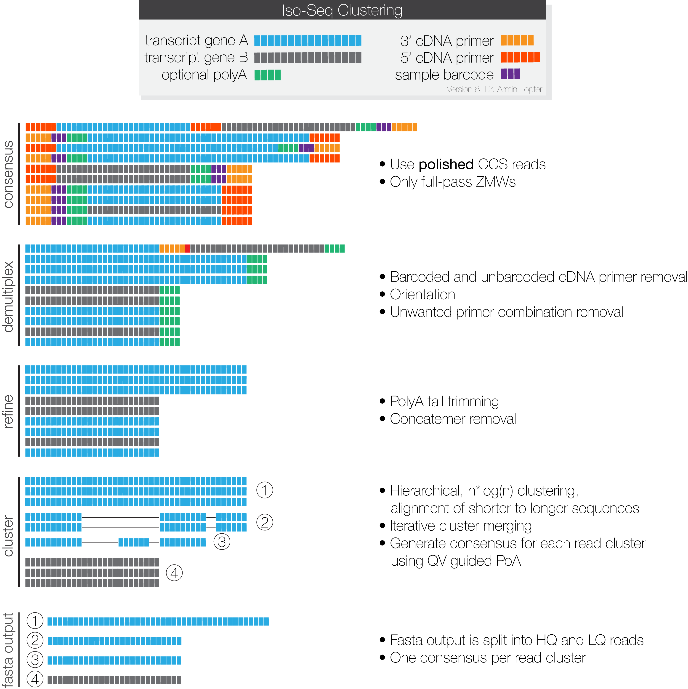

<h1 align="center"></h1>
<h1 align="center">IsoSeq v3</h1>

Generate transcripts by clustering HiFi reads

***

## High-level workflow

The high-level workflow depicts files and processes:

## Mid-level workflow

The mid-level workflow schematically explains what happens at each stage:

## Low-level workflow

The low-level workflow explained via CLI calls. All necessary dependencies are
installed via bioconda.

### Step 0 - Input
For each SMRT cell a `movieX.subreads.bam` is needed for processing.

### Step 1 - Circular Consensus Sequence calling
Each sequencing run is processed by [*ccs*](https://github.com/PacificBiosciences/ccs)
to generate one representative circular consensus sequence (CCS) for each ZMW.
It is advised to use the latest CCS version 4.2.0 or newer.
_ccs_ can be installed with `conda install pbccs`.

    $ ccs movieX.subreads.bam movieX.ccs.bam --min-rq 0.9

You can easily parallelize _ccs_ generation by chunking, please follow [this how-to](https://github.com/PacificBiosciences/ccs#how-can-I-parallelize-on-multiple-servers).

### Step 2 - Primer removal and demultiplexing
Removal of primers and identification of barcodes is performed using [*lima*](https://github.com/pacificbiosciences/barcoding),
which can be installed with \
`conda install lima` and offers a specialized `--isoseq` mode.
Even in the case that your sample is not barcoded, primer removal is performed
by *lima*.
If there are more than two sequences in your `primer.fasta` file or better said
more than one pair of 5' and 3' primers, please use *lima* with `--peek-guess`
to remove spurious false positive signal.
More information about how to name input primer(+barcode)
sequences in this [FAQ](https://github.com/pacificbiosciences/barcoding#how-can-i-demultiplex-isoseq-data).

    $ lima movieX.ccs.bam barcoded_primers.fasta movieX.fl.bam --isoseq --peek-guess

**Example 1:**
Following is the `primer.fasta` for the Clontech SMARTer and NEB cDNA library
prep, which are the officially recommended protocols:

    >NEB_5p
    GCAATGAAGTCGCAGGGTTGGG
    >Clontech_5p
    AAGCAGTGGTATCAACGCAGAGTACATGGGG
    >NEB_Clontech_3p
    GTACTCTGCGTTGATACCACTGCTT

**Example 2:**
Following are examples for barcoded primers using a 16bp barcode followed by
Clontech primer:

    >primer_5p
    AAGCAGTGGTATCAACGCAGAGTACATGGGG
    >brain_3p
    CGCACTCTGATATGTGGTACTCTGCGTTGATACCACTGCTT
    >liver_3p
    CTCACAGTCTGTGTGTGTACTCTGCGTTGATACCACTGCTT

*Lima* will remove unwanted combinations and orient sequences to 5' → 3' orientation.

Output files will be called according to their primer pair. Example for
single sample libraries:

    movieX.fl.NEB_5p--NEB_Clontech_3p.bam

If your library contains multiple samples, execute the following workflow
for each primer pair:

    movieX.fl.primer_5p--brain_3p.bam
    movieX.fl.primer_5p--liver_3p.bam

### Step 3 - Refine
Your data now contains full-length reads, but still needs to be refined by:
 - [Trimming](https://github.com/PacificBiosciences/trim_isoseq_polyA) of poly(A) tails
 - Rapid concatmer [identification](https://github.com/jeffdaily/parasail) and removal

**Input**
The input file for *refine* is one demultiplexed CCS file with full-length reads
and the primer fasta file:
 - `<movie.primer--pair>.fl.bam` or `<movie.primer--pair>.fl.consensusreadset.xml`
 - `primers.fasta`

**Output**
The following output files of *refine* contain full-length non-concatemer reads:
 - `<movie>.flnc.bam`
 - `<movie>.flnc.transcriptset.xml`

Actual command to refine:

    $ isoseq refine movieX.NEB_5p--NEB_Clontech_3p.fl.bam primers.fasta movieX.flnc.bam

If your sample has poly(A) tails, use `--require-polya`.
This filters for FL reads that have a poly(A) tail
with at least 20 base pairs (`--min-polya-length`) and removes identified tail:

    $ isoseq refine movieX.NEB_5p--NEB_Clontech_3p.fl.bam movieX.flnc.bam --require-polya

### Step 3b - Merge SMRT Cells
If you used more than one SMRT cells, list all of your `<movie>.flnc.bam` in one
`flnc.fofn`, a file of filenames:

    $ ls movie*.flnc.bam movie*.flnc.bam movie*.flnc.bam > flnc.fofn

### Step 4 - Clustering
Compared to previous IsoSeq approaches, *IsoSeq v3* performs a single clustering
technique.
Due to the nature of the algorithm, it can't be efficiently parallelized.
It is advised to give this step as many coresas possible.
The individual steps of *cluster* are as following:

 - Clustering using hierarchical n*log(n) [alignment](https://github.com/lh3/minimap2) and iterative cluster merging
 - Polished [POA](https://github.com/rvaser/spoa) sequence generation, using a QV guided consensus approach

**Input**
The input file for *cluster* is one FLNC file:
 - `<movie>.flnc.bam` or `flnc.fofn`

**Output**
The following output files of *cluster* contain polished isoforms:
 - `<prefix>.bam`
 - `<prefix>.hq.fasta.gz` with predicted accuracy ≥ 0.99
 - `<prefix>.lq.fasta.gz` with predicted accuracy < 0.99
 - `<prefix>.bam.pbi`
 - `<prefix>.transcriptset.xml`

Example invocation:

    $ isoseq cluster flnc.fofn clustered.bam --verbose --use-qvs

### Step 5 - Optional polishing and per base QV calculation
In this optional step, you can generate per base QVs for transcript consensus
sequences and improve results minimally.
The tool for this is called *polish* and it uses the original subreads in addition.
This step is very time consuming and you likely do not need the extra
quality and QVs.

If you have more than one cell worth of data, you must merge the `subreadset.xml`
files. Please use `dataset` for merging, which can be installed with
`conda install pbcoretools`.
Merge all of your **source** `<movie>.subreadset.xml` files:

    $ dataset create --type SubreadSet merged.subreadset.xml movie1.subreadset.xml movie2.subreadset.xml movieN.subreadset.xml

**Input**
The input files for *polish* are:
 - `<clustered>.bam` or `<clustered>.transcriptset.xml`
 - `<movieX>.subreadset.xml` or `merged.subreadset.xml`

**Output**
The following output files of *polish* contain polished isoforms:
 - `<prefix>.bam`
 - `<prefix>.transcriptset.xml`
 - `<prefix>.hq.fasta.gz` with predicted accuracy ≥ 0.99
 - `<prefix>.lq.fasta.gz` with predicted accuracy < 0.99
 - `<prefix>.hq.fastq.gz` with predicted accuracy ≥ 0.99
 - `<prefix>.lq.fastq.gz` with predicted accuracy < 0.99

Example invocation:

    $ isoseq polish clustered.bam merged.subreadset.xml polished.bam

### Alternative Step 4/5 - Parallel Polishing
Polishing can be massively parallelized on multiple servers by splitting
the `clustered.bam` file.
Split BAM files can be generated by *cluster*.

    $ isoseq cluster flnc.fofn clustered.bam --verbose --use-qvs --split-bam 24

This will create up to 24 output BAM files:

    clustered.0.bam
    clustered.1.bam
    ...

Each of those `clustered.<X>.bam` files can be polished in parallel:

    $ isoseq polish clustered.0.bam merged.subreadset.xml polished.0.bam
    $ isoseq polish clustered.1.bam merged.subreadset.xml polished.1.bam
    $ ...

## Real-world example
This is an example of an end-to-end cmd-line-only workflow to get from
subreads to polished isoforms:

    $ wget https://downloads.pacbcloud.com/public/dataset/RC0_1cell_2017/m54086_170204_081430.subreads.bam
    $ wget https://downloads.pacbcloud.com/public/dataset/RC0_1cell_2017/m54086_170204_081430.subreads.bam.pbi
    $ wget https://downloads.pacbcloud.com/public/dataset/RC0_1cell_2017/m54086_170204_081430.subreadset.xml

    $ ccs --version
    ccs 4.0.0

    $ ccs m54086_170204_081430.subreads.bam m54086_170204_081430.ccs.bam --min-rq 0.9

    $ cat primers.fasta
    >primer_5p
    AAGCAGTGGTATCAACGCAGAGTACATGGGG
    >primer_3p
    AAGCAGTGGTATCAACGCAGAGTAC

    $ lima --version
    lima 1.10.0 (commit v1.10.0)

    $ lima m54086_170204_081430.ccs.bam primers.fasta m54086_170204_081430.fl.bam --isoseq

    $ ls m54086_170204_081430.fl*
    m54086_170204_081430.fl.json         m54086_170204_081430.fl.lima.summary
    m54086_170204_081430.fl.lima.clips   m54086_170204_081430.fl.primer_5p--primer_3p.bam
    m54086_170204_081430.fl.lima.counts  m54086_170204_081430.fl.primer_5p--primer_3p.subreadset.xml
    m54086_170204_081430.fl.lima.report

    $ isoseq refine m54086_170204_081430.fl.primer_5p--primer_3p.bam primers.fasta m54086_170204_081430.flnc.bam

    $ ls m54086_170204_081430.flnc.*
    m54086_170204_081430.flnc.bam                   m54086_170204_081430.flnc.filter_summary.json
    m54086_170204_081430.flnc.bam.pbi               m54086_170204_081430.flnc.report.csv
    m54086_170204_081430.flnc.consensusreadset.xml

    $ isoseq cluster m54086_170204_081430.flnc.bam clustered.bam --verbose --use-qvs
    Read BAM                 : (197791) 4s 20ms
    Convert to reads         : 1s 431ms
    Sort Reads               : 56ms 947us
    Aligning Linear          : 2m 5s
    Read to clusters         : 9s 432ms
    Aligning Linear          : 54s 288ms
    Merge by mapping         : 36s 138ms
    Consensus                : 30s 126ms
    Merge by mapping         : 5s 418ms
    Consensus                : 3s 597ms
    Write output             : 1s 134ms
    Complete run time        : 4m 32s

    $ ls clustered*
    clustered.bam       clustered.hq.fasta.gz
    clustered.bam.pbi   clustered.lq.fasta.gz
    clustered.cluster   clustered.transcriptset.xml

## DISCLAIMER

THIS WEBSITE AND CONTENT AND ALL SITE-RELATED SERVICES, INCLUDING ANY DATA, ARE PROVIDED "AS IS," WITH ALL FAULTS, WITH NO REPRESENTATIONS OR WARRANTIES OF ANY KIND, EITHER EXPRESS OR IMPLIED, INCLUDING, BUT NOT LIMITED TO, ANY WARRANTIES OF MERCHANTABILITY, SATISFACTORY QUALITY, NON-INFRINGEMENT OR FITNESS FOR A PARTICULAR PURPOSE. YOU ASSUME TOTAL RESPONSIBILITY AND RISK FOR YOUR USE OF THIS SITE, ALL SITE-RELATED SERVICES, AND ANY THIRD PARTY WEBSITES OR APPLICATIONS. NO ORAL OR WRITTEN INFORMATION OR ADVICE SHALL CREATE A WARRANTY OF ANY KIND. ANY REFERENCES TO SPECIFIC PRODUCTS OR SERVICES ON THE WEBSITES DO NOT CONSTITUTE OR IMPLY A RECOMMENDATION OR ENDORSEMENT BY PACIFIC BIOSCIENCES.
