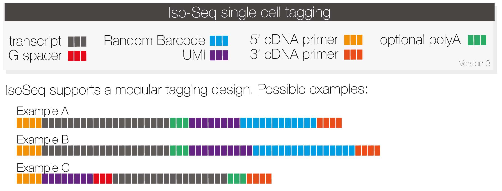
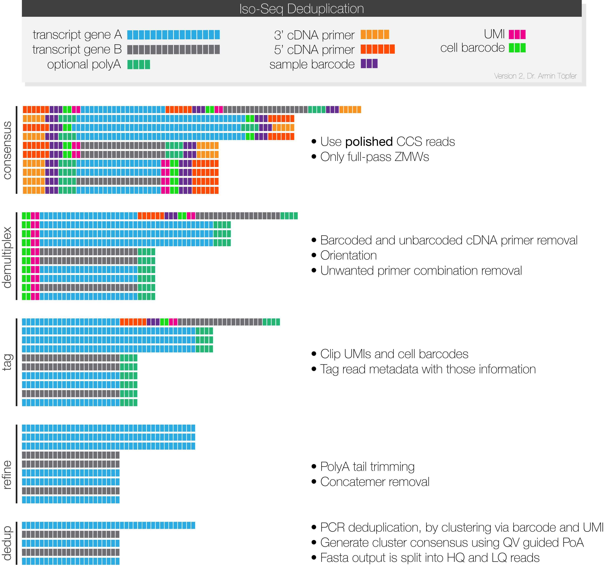

<h1 align="center"></h1>
<h1 align="center">IsoSeq v3</h1>

Generate transcripts by PCR deduplication (single-cell and UMIs) 

***

## UMI/Barcode designs

Following schematic explains how IsoSeq supports single-cell tags:

The tool of choice to clip tags (cell barcode, UMI, Gs), is `isoseq tag`.
It supports design presets and custom experimental designs.
Tags are abbreviated with a single character with optional length.

`T` indicates the transcript position and is mandatory.
It is the anchor to determine if tags are located on the 3' or 5' side.\
`U` as in UMI must be preceeded by the length of the UMI.\
`B` as in cell barcode must be preceed by the length of the cell barcode.\
`G` is a special PacBio 5' UMI tag with a `GGG` suffix.

Let's explain by example, the `Example A` design of 8bp UMI 5' and 12bp barcode 5'
can be specified with this string:

    T-8U-12B

Tags are concatenated with hypens.

Similarly, the `Example B`design:

    T-10U-16B

The `Example C` design for a 8bp UMI 5' with a fixed 3G UMI is:

    8G-T

If you have a custom experiment, combine any of those tags uniquely, for example
the a 6bp UMI 5' and a 13bp barcode 3':

    6U-T-13U

## Workflow overview

The high-level workflow depicts files and processes:

## Mid-level workflow

The mid-level workflow schematically explains what happens at each stage:

## Low-level workflow

The low-level workflow explained via CLI calls. All necessary dependencies are
installed via bioconda.

### Step 0 - Input
For each SMRT cell a `movieX.subreads.bam` is needed for processing.

### Step 1 - Circular Consensus Sequence calling
Each sequencing run is processed by [*ccs*](https://github.com/PacificBiosciences/ccs)
to generate one representative circular consensus sequence (CCS) for each ZMW. Only ZMWs with
at least one full pass (at least one subread with SMRT adapter on both ends) are
used for the subsequent analysis. In contrast to older IsoSeq versions,
CCS polishing is required to enable skipping of the transcript polishing.
It is advised to use the latest CCS version 4.0.0 or newer.
_ccs_ can be installed with `conda install pbccs`.

    $ ccs movieX.subreads.bam movieX.ccs.bam --min-rq 0.9

More info how to [easily chunk ccs](https://github.com/PacificBiosciences/ccs#how-can-I-parallelize-on-multiple-servers).

### Step 2 - Primer removal and demultiplexing
Removal of primers and identification of barcodes is performed using [*lima*](https://github.com/pacificbiosciences/barcoding),
which can be installed with \
`conda install lima` and offers a specialized `--isoseq` mode.
Even in the case that your sample is not barcoded, primer removal is performed
by *lima*.
If there are more than two sequences in your `primer.fasta` file or better said
more than one pair of 5' and 3' primers, please use *lima* with `--peek-guess`
to remove spurious false positive signal.
More information about how to name input primer(+barcode)
sequences in this [FAQ](https://github.com/pacificbiosciences/barcoding#how-can-i-demultiplex-isoseq-data).

    $ lima movieX.ccs.bam barcoded_primers.fasta movieX.fl.bam --isoseq --peek-guess

**Example 1:**
Following is the `primer.fasta` for the Clontech SMARTer and NEB cDNA library
prep, which are the officially recommended protocols:

    >NEB_5p
    GCAATGAAGTCGCAGGGTTGGG
    >Clontech_5p
    AAGCAGTGGTATCAACGCAGAGTACATGGGG
    >NEB_Clontech_3p
    GTACTCTGCGTTGATACCACTGCTT

**Example 2:**
Following are examples for barcoded primers using a 16bp barcode followed by
Clontech primer:

    >primer_5p
    AAGCAGTGGTATCAACGCAGAGTACATGGGG
    >brain_3p
    CGCACTCTGATATGTGGTACTCTGCGTTGATACCACTGCTT
    >liver_3p
    CTCACAGTCTGTGTGTGTACTCTGCGTTGATACCACTGCTT

*Lima* will remove unwanted combinations and orient sequences to 5' → 3' orientation.

Output files will be called according to their primer pair. Example for
single sample libraries:

    movieX.fl.NEB_5p--NEB_Clontech_3p.bam

If your library contains multiple samples, execute the following workflow
for each primer pair:

    movieX.fl.primer_5p--brain_3p.bam
    movieX.fl.primer_5p--liver_3p.bam

### Step 3 - Tag
Tags, such as UMIs and cell barcodes, have to be clipped from the reads and
associated with the reads for later deduplication.

**Input**
The input file for *tag* is one demultiplexed CCS file with full-length reads:
 - `<movie.primer--pair>.fl.bam` or `<movie.primer--pair>.fl.consensusreadset.xml`

**Output**
The following output files of *tag* contain full-length tagged:
 - `<movie>.flt.bam`
 - `<movie>.flt.transcriptset.xml`

Insert your own design or pick a preset:

    $ isoseq tag movieX.NEB_5p--NEB_Clontech_3p.fl.bam movieX.flt.bam --design XXX

### Step 4 - Refine
Your data now contains full-length tagged reads, but still needs to be refined by:
 - [Trimming](https://github.com/PacificBiosciences/trim_isoseq_polyA) of poly(A) tails
 - Rapid concatmer [identification](https://github.com/jeffdaily/parasail) and removal

**Input**
The input file for *refine* full-length tagged reads and the primer fasta file:
 - `<movie.primer--pair>.flt.bam` or `<movie.primer--pair>.flt.consensusreadset.xml`
 - `primers.fasta`

**Output**
The following output files of *refine* contain full-length non-concatemer reads:
 - `<movie>.fltnc.bam`
 - `<movie>.fltnc.transcriptset.xml`

Actual command to refine:

    $ isoseq refine movieX.NEB_5p--NEB_Clontech_3p.fl.bam primers.fasta movieX.fltnc.bam

If your sample has poly(A) tails, use `--require-polya`.
This filters for FL reads that have a poly(A) tail
with at least 20 base pairs and removes identified tail:

    $ isoseq refine movieX.NEB_5p--NEB_Clontech_3p.fl.bam movieX.fltnc.bam --require-polya

Optional read quality filtering, if your initial CCS input is `<movie>.reads.bam`

    $ isoseq refine movieX.NEB_5p--NEB_Clontech_3p.fl.bam movieX.flnc.bam --min-rq 0.9

### Step 4b - Merge SMRT Cells
If you used more than one SMRT cells, merge all of your `<movie>.fltnc.bam` files:

    $ ls movie1.fltnc.bam movie2.fltnc.bam movieN.fltnc.bam > fltnc.fofn

### Step 5 - Deduplication
This step performs PCR deduplicatation via clustering by UMI and cell barcodes (if available).
After deduplication, *dedup* generates one consensus sequence per founder molecule,
using a QV guided consensus approach.

**Method**

Perform all vs all comparison and cluster two reads if:
 * lengths are within +- 50 bp length
 * UMI (+cell barcode) match with at max 1 mismatch and may be shifted by at max 1 base
 * pairwise concordance is at least 97%
 * alignment starts/ends within 5 bp of the other read
 * no more than 5 bps are deleted or inserted in a window of 20 bp (like in isoseq cluster)

**Input**
The input file for *dedup* is one FLTNC file:
 - `<movie>.fltnc.bam` or `fltnc.fofn`

**Output**
The following output files of *dedup* contain polished isoforms:
 - `<prefix>.bam`
 - `<prefix>.hq.fasta.gz` with predicted accuracy ≥ 0.99
 - `<prefix>.lq.fasta.gz` with predicted accuracy < 0.99
 - `<prefix>.bam.pbi`
 - `<prefix>.transcriptset.xml`

Example invocation:

    $ isoseq dedup fltnc.fofn dedup.bam --verbose

## Real-world example
This is an example of an end-to-end cmd-line-only workflow:

    # Download HiFi reads
    $ wget https://downloads.pacbcloud.com/public/dataset/ISMB_workshop/singlecell/ccs.bam

    # Download primers
    $ wget https://downloads.pacbcloud.com/public/dataset/ISMB_workshop/singlecell/primers.fasta

    # Check lima version to be >= 2.0.0
    $ lima --version
    lima 2.0.0 (commit v2.0.0)

    # Check isoseq version to be >= 3.4.0
    $ isoseq --version
    isoseq 3.4.0 (commit v3.4.0)

    # Primer removal
    $ lima --isoseq ccs.bam primers.fasta output.bam

    # Clip UMI and cell barcode
    $ isoseq tag output.5p--3p.bam flt.bam --design T-8U-12B

    # Remove poly(A) tails and concatemer
    $ isoseq refine flt.bam primers.fasta fltnc.bam --require-polya

    # Deduplicate transcripts from the identical molecule
    $ isoseq dedup fltnc.bam dedup.bam --log-level INFO

## DISCLAIMER

THIS WEBSITE AND CONTENT AND ALL SITE-RELATED SERVICES, INCLUDING ANY DATA, ARE PROVIDED "AS IS," WITH ALL FAULTS, WITH NO REPRESENTATIONS OR WARRANTIES OF ANY KIND, EITHER EXPRESS OR IMPLIED, INCLUDING, BUT NOT LIMITED TO, ANY WARRANTIES OF MERCHANTABILITY, SATISFACTORY QUALITY, NON-INFRINGEMENT OR FITNESS FOR A PARTICULAR PURPOSE. YOU ASSUME TOTAL RESPONSIBILITY AND RISK FOR YOUR USE OF THIS SITE, ALL SITE-RELATED SERVICES, AND ANY THIRD PARTY WEBSITES OR APPLICATIONS. NO ORAL OR WRITTEN INFORMATION OR ADVICE SHALL CREATE A WARRANTY OF ANY KIND. ANY REFERENCES TO SPECIFIC PRODUCTS OR SERVICES ON THE WEBSITES DO NOT CONSTITUTE OR IMPLY A RECOMMENDATION OR ENDORSEMENT BY PACIFIC BIOSCIENCES.
